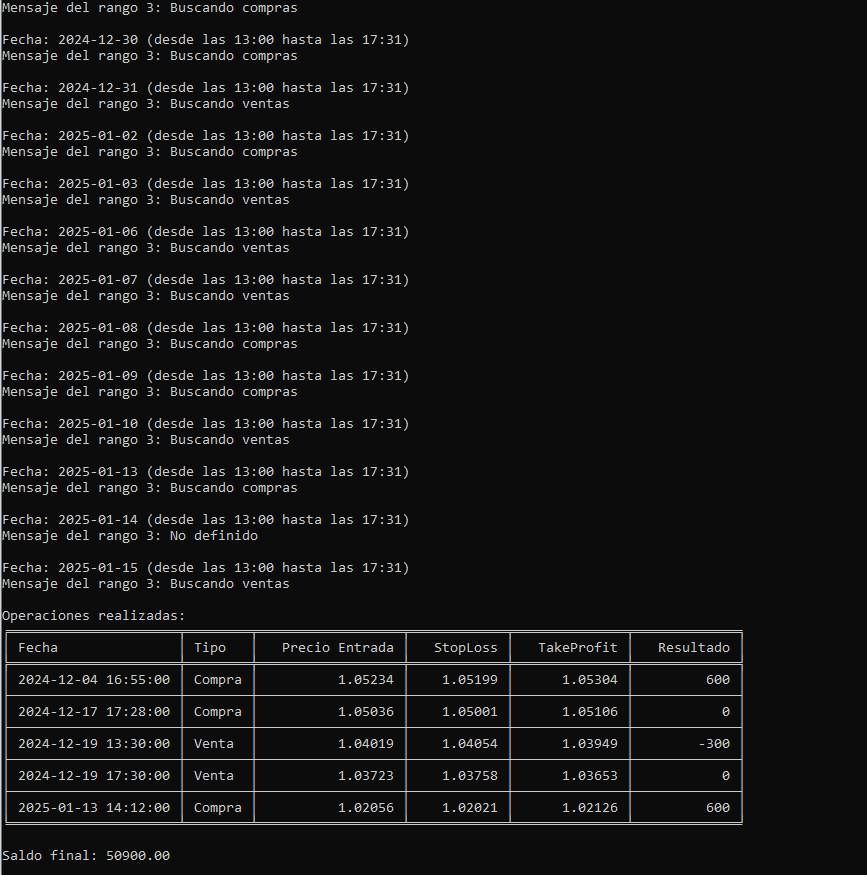

# Bot-Trading 📈

Este proyecto es un bot de trading planificado y diseñado para analizar y ejecutar estrategias basadas en el comportamiento real del mercado. Utiliza **MetaTrader 5** y una cuenta demo del broker **Exness** para descargar datos históricos del par **EUR/USD** y evaluar el rendimiento de una estrategia cuantificada.

---

## 📋 Descripción

El bot fue desarrollado con el objetivo de:
- Conectar con MetaTrader 5 mediante una cuenta demo para obtener datos reales.
- Analizar y ejecutar estrategias basadas en confirmaciones detalladas de comportamiento del mercado.
- Cuantificar el rendimiento de la estrategia en términos de ganancias y pérdidas.
- Presentar resultados en un formato estructurado que incluye operaciones, saldo final y métricas clave.

**Limitaciones actuales**:
- El bot no permite descargar datos históricos más allá de **2 meses**.
- No fue posible realizar análisis sobre velas de 1 minuto debido a restricciones en la descarga de datos.

A pesar de estas limitaciones, el bot permite evaluar la estrategia dentro del rango de datos disponibles, proporcionando información valiosa para ajustar y optimizar el enfoque.

---

## 🛠️ Herramientas y Tecnologías

- **Python 3.8+**  
- **MetaTrader 5 (librería y plataforma)**: Conexión con MetaTrader 5 para obtener datos históricos reales.  
- **Pandas**: Manipulación y análisis de datos.  
- **Numpy**: Operaciones matemáticas y soporte de arrays.  
- **Tabulate**: Formatear y mostrar tablas en la terminal.  

---

## 🚀 Cómo Ejecutar el Proyecto
- Activar el entorno virtual:
mt5_env\Scripts\activate

- Ejecuta el programa dentro del entorno virtual
Una vez activado el entorno virtual, corre el programa con:
python test_mt5.py

- Si arroja error borra la carpeta mt5_env y reinstala las dependencias necesarias
Recrea el entorno virtual: Elimina la carpeta mt5_env y crea un nuevo entorno virtual:
python -m venv mt5_env

A veces, una instalación no se completa correctamente. Asegúrate de que las librerías requeridas esten instaladas en el entorno virtual:
pip install MetaTrader5 pandas numpy
pip install tabulate

## 🚀 Ejecucion y resultado
