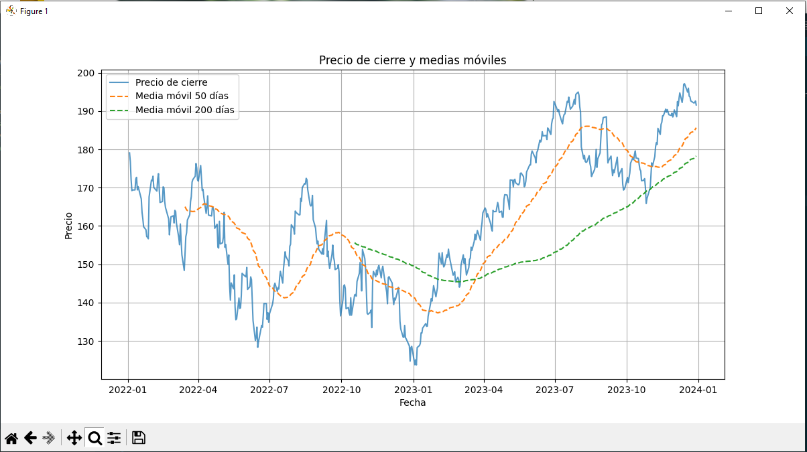

# Análisis Financiero Básico 📈

Este proyecto descarga y analiza datos históricos de acciones para generar un gráfico con el precio de cierre y medias móviles de 50 y 200 días. Es ideal para realizar un análisis técnico básico de un activo financiero.

---

## 🔧 Herramientas y Tecnologías Utilizadas

- **Lenguaje de programación:** Python 3.8+
- **Librerías:**
  - `yfinance`: Para descargar datos históricos de activos financieros.
  - `pandas`: Para manipulación y análisis de datos.
  - `matplotlib`: Para crear gráficos estáticos.
- **Editor recomendado:** Visual Studio Code o cualquier editor compatible con Python.
- **Sistema operativo:** Compatible con Windows, macOS y Linux.

## 🚀 Cómo ejecutar el proyecto

### 1. Clonar el repositorio
git clone https://github.com/TuUsuario/data-science-projects.git
cd data-science-projects/financial-analysis

### 2. Crear un entorno virtual e instalar dependencias
Copiar código
python -m venv venv
source venv/bin/activate  # En Linux/Mac
venv\Scripts\activate     # En Windows
pip install -r requirements.txt

### 3. Descargar datos históricos
Ejecuta el script para descargar datos históricos de la acción seleccionada (por defecto: Apple AAPL):

Copiar código
python scripts/download_data.py
El archivo de datos se guardará en la carpeta data/.

### 4. Analizar y graficar
Ejecuta el script de análisis para generar el gráfico:

Copiar código
python scripts/analyze_data.py
Aparecerá una ventana con el gráfico del precio de cierre y las medias móviles.

### 📂 Estructura del proyecto

financial-analysis/
├── data/                # Carpeta para almacenar datos descargados
├── notebooks/           # Espacio para notebooks (opcional)
├── scripts/             # Scripts principales del proyecto
│   ├── download_data.py # Descarga datos históricos
│   └── analyze_data.py  # Analiza y grafica los datos
├── README.md            # Detalles del proyecto
├── requirements.txt     # Dependencias del proyecto

### 🛠️ Personalización
Para cambiar la acción, edita el archivo download_data.py y modifica el ticker:

ticker = "MSFT"  # Cambia "MSFT" por el ticker deseado
Ejemplos de tickers:
EUR/USD: "EURUSD=X"
Bitcoin: "BTC-USD"
S&P 500: "^GSPC"
📝 Resultado
El gráfico generado incluye:

Precio de cierre: Línea azul que representa el precio diario.
Media móvil de 50 días: Línea naranja que suaviza las fluctuaciones de corto plazo.
Media móvil de 200 días: Línea verde que muestra tendencias de largo plazo.
